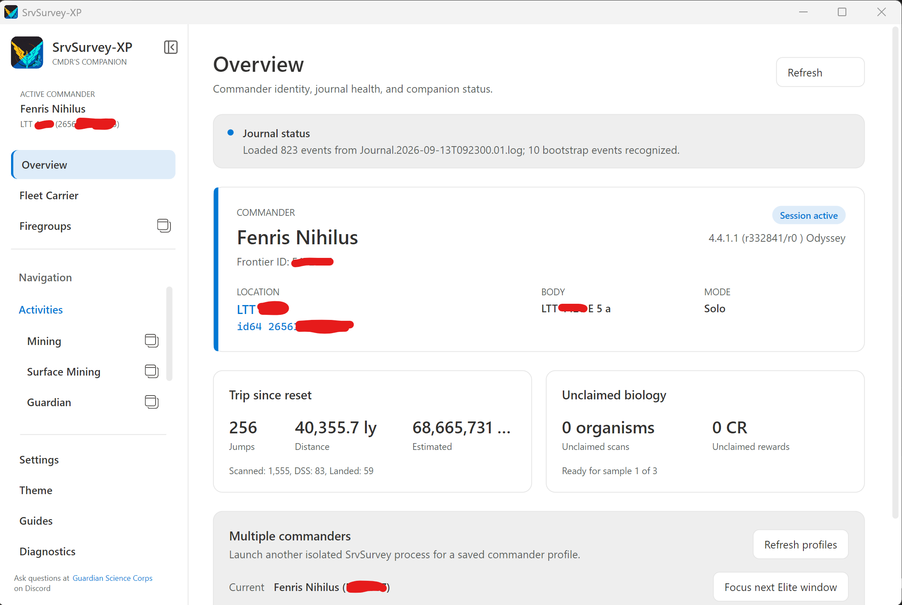
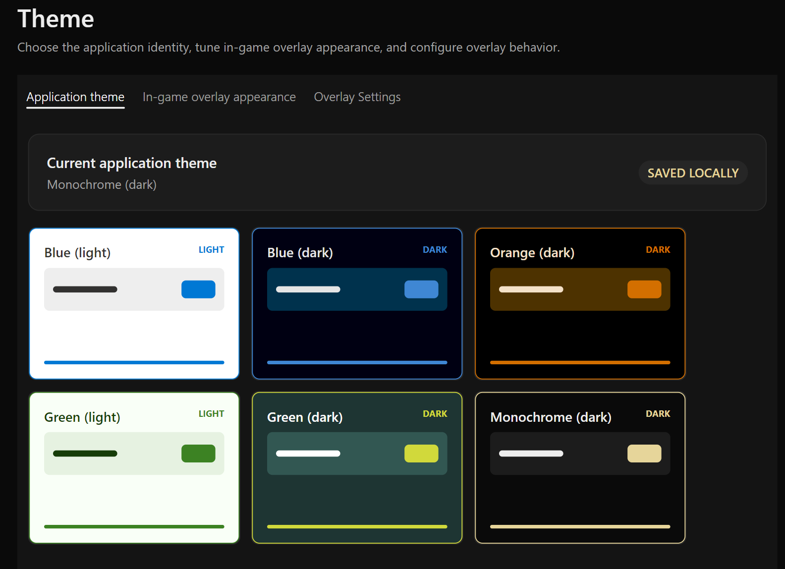
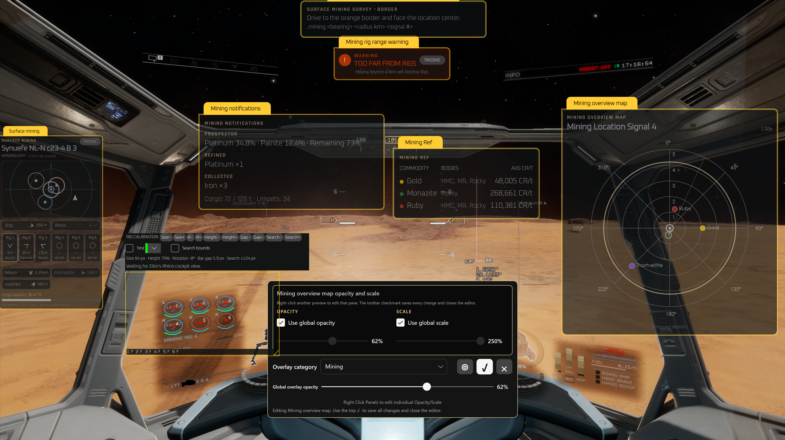
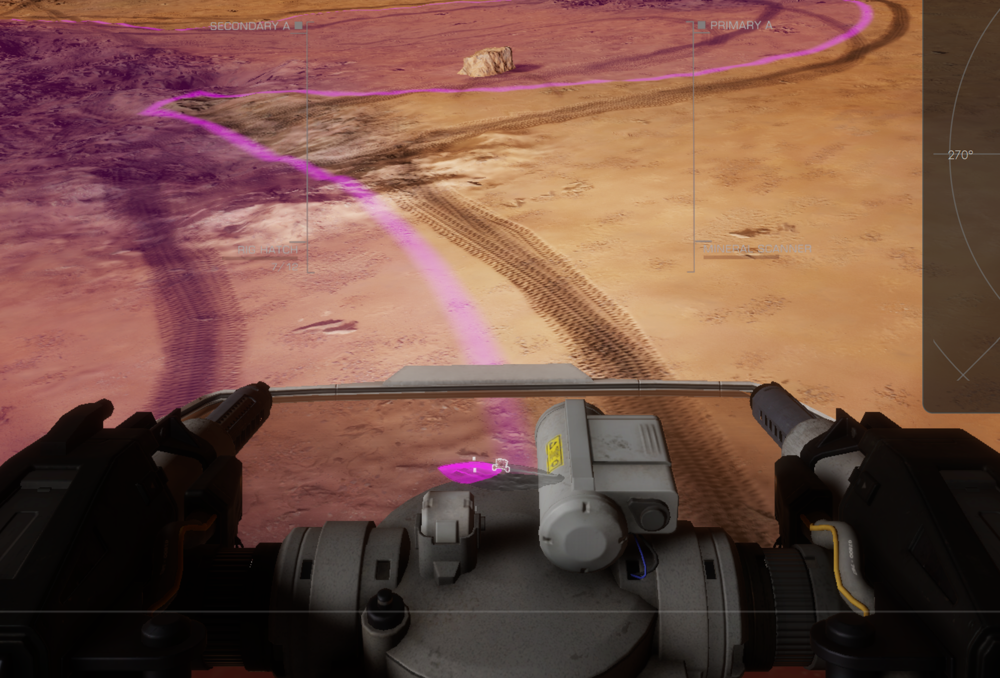
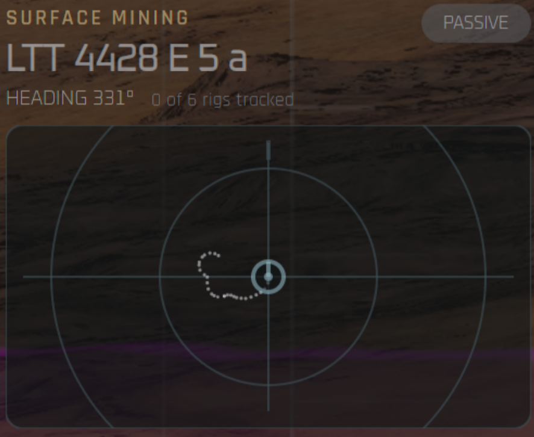
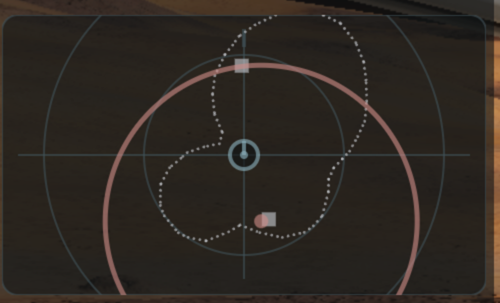

# SrvSurvey-XP

[](https://github.com/Fenris159/SrvSurvey/releases)
[](https://github.com/Fenris159/SrvSurvey/actions/workflows/build-srvsurvey-xp.yml)
[](https://sonarcloud.io/summary/new_code?id=Fenris159_SrvSurvey)
[](https://sonarcloud.io/component_measures?id=Fenris159_SrvSurvey&metric=coverage)
[](LICENSE)

[](https://github.com/Fenris159/SrvSurvey/tree/SrvSurvey-Avalonia/src)
[](https://dotnet.microsoft.com/)
[](https://avaloniaui.net/)
[](https://github.com/mono/SkiaSharp)
[](https://www.libsdl.org/)
[](https://csharpier.com/)
[](docs/INSTALL_WINDOWS.md)
[](docs/INSTALL_LINUX.md)
[](#themes-overlays-and-accessibility)

SrvSurvey-XP is a cross-platform companion for **Elite Dangerous**. It reads the
game's journal and auxiliary files and turns them into live exploration,
exobiology, mining, navigation, Guardian, quest, colonization, combat and Fleet
Carrier tools. Its configurable in-game overlays keep useful information in view
without requiring constant window switching.

**[Download the current release](https://github.com/Fenris159/SrvSurvey/releases)**
· [Read the current release notes](CurrentReleaseNotes.md)
· [Report an issue](https://github.com/Fenris159/SrvSurvey/issues)

## Application preview

The images stay compact on this page. Select any tile to open the full screenshot.

<table>
  <tr>
    <td width="33%" align="center">
      <a href="docs/images/readme/commander-overview.png"></a><br>
      <sub>Commander overview and live journal state</sub>
    </td>
    <td width="33%" align="center">
      <a href="docs/images/readme/application-themes.png"></a><br>
      <sub>Six coordinated light and dark application themes</sub>
    </td>
    <td width="33%" align="center">
      <a href="docs/images/readme/overlay-editor.png"></a><br>
      <sub>Overlay editor with Mining panels and per-panel controls</sub>
    </td>
  </tr>
</table>

## Features

### Commander overview and live game state

- Shows the active Commander, game mode, system, body, journal health, current
  session and high-level trip and exobiology totals.
- Discovers Elite journals across supported Windows installations and common
  Linux Steam, Heroic, Frontier/Wine, Lutris and Bottles layouts.
- Supports multiple Commander profiles and can start an isolated SrvSurvey
  process for another saved Commander. Reopening the executable directly warns
  before replacing an existing instance; intentional parallel instances start
  from the Multiple commanders card.
- Optionally links a Frontier account with OAuth to enrich the Commander, Fleet
  Carrier, cargo, shipyard, market and Community Goal views.
- Combines live and historical journal data with public Community Goal details
  while keeping each Commander's personal contribution local.
- Rebuilds application state from historical journals and provides detailed
  source, processing, event-inspection and log diagnostics.

### Exploration and exobiology

- Tracks FSS and DSS progress, discovered bodies, system completion, first
  footfall status, estimated exploration value and prior scan information.
- Presents body information, orbital relationships, rings, surface signals and
  route-relevant stellar details in the application and overlays.
- Predicts possible organisms from body, atmosphere, temperature, gravity,
  volcanism, region and stellar conditions.
- Tracks active organic sampling, sample distance, unclaimed discoveries and
  estimated rewards, including first-footfall bonuses.
- Includes Codex reference browsing, regional discovery progress, Codex Bingo,
  Commander history and Canonn-backed discovery information.
- Supports procedural boxel searches, completion auditing and survey statistics
  for systematic exploration projects.

### Travel, routes and location tools

- Records journeys with systems, screenshots and statistics, and preserves the
  active journey across sessions.
- Imports and follows routes, including Spansh route results and Fleet Carrier
  routes, with jump, refuel and neutron-star guidance overlays.
- Provides spherical searches, nearby-system and biology searches, distance
  shortcuts and ground-target navigation.
- Maintains shared bookmarks for systems, bodies, rings and surface locations
  with categories, notes, attached screenshots and JSON import/export. Surface
  Mining maps add favorites and a favorites-only filter.
- Tracks Fleet Carrier identity, cargo, plotted jumps and construction-project
  relationships from journal and optional Frontier data.

### Ship mining workspace

- Records mining sessions, elapsed time, asteroid counts, prospecting results,
  refinery output, raw materials, cargo and mining missions.
- Keeps sortable current and historical reports, manual refinery estimates,
  notes, screenshots and CSV history import.
- Produces offline HTML reports suitable for printing or saving as PDF, plus ZIP
  backups containing mining data, shared bookmarks and screenshot attachments.
- Provides ship-only mining notifications with several persistent prospector
  results, a dedicated cargo-capacity overlay and highlighted mineral targets.
- Configurable mineral thresholds and named announcement presets use separate
  selectable lists, including rename/delete workflows. Announcements can use a
  built-in chime or local Windows/Linux speech services.
- Includes a Firegroups workspace and reference overlay so mining equipment and
  active groups remain visible in the cockpit.

#### Finding places to mine

- **Hotspot List** shows supported commodities, compatible body types and a
  community price snapshot. Chosen commodities can stay visible in the compact
  Mining Ref overlay.
- **Surface Hunt** ranks useful body types and shows geology, stellar clues and
  market values for finding promising planetary mining locations.
- Ring and hotspot searches combine local data, bundled reference data and
  Spansh results. Commodity-market, system and trader searches include distance
  shortcuts and available Fleet Carrier observations.
- Optional receive-only EDDN observations can supplement commodity prices and
  Powerplay information. Market observations can age or change, so confirm the
  destination before committing a full cargo load.

### Surface Mining maps and survey guidance

Surface Mining combines reusable planetary mining-location maps with live Rhino
guidance. The complete workflow is also available in **Guides > Surface mining**
inside the application and in the [Surface Mining guide](docs/SURFACE_MINING.md).

- Creates a separate bookmark for each planetary mining-location signal using
  its measured border radius, calculated center and signal number.
- Automatically selects the relevant map when the player enters its saved border
  and unloads it after leaving the location.
- Stores each deposit's commodity, mineral amount, density, coordinates, bearing,
  distance, update time and rig capacity. Low, Medium and High accept the shorter
  `l`, `m` and `h` command forms.
- Shows fixed 1 km distance rings through the first whole-kilometer ring outside
  the saved border. Map zoom enlarges deposits and the location geometry while
  bearing spokes remain fixed and readable.
- Filters deposit markers by commodity, mineral amount and density. Labels can be
  hidden in the Overview Map while rig counts remain visible.
- Supports map favorites, expandable per-deposit bookmark details, a movable
  4.5 km planning circle and UTF-8 CSV export for third-party tools.
- Places distant deposit markers from the player's live coordinates, or records
  exact `here` positions. Duplicate protection prevents likely accidental
  same-commodity markers while precise overlapping deposits remain possible.
- Re-centers a corrected map without moving existing deposits and can move the
  nearest matching marker to the player's current position.

#### Guided location survey

Start `.mining survey` to open a dedicated overlay that walks through border and
center setup and then generates an efficient outward scan route. Waypoints remain
inside the measured location border, account for the surface scanner's 2 km
coverage while the Rhino is moving and visit small coverage gaps while the player
is already nearby. Progress is saved after every phase and waypoint so the route
can resume after a game or application restart.

The guide keeps deposit-marking commands visible while scanning. Use
`.mining waypoint next`, `.mining waypoint prev` or `.mining survey complete` to
adjust or finish the route manually.

#### Rhino rig tracking

- Tracks six rig positions per Commander, system and body through configurable
  shortcuts and restores them after restart.
- Draws 70 m rig work rings, live bearing and distance cues, a close pickup cue
  below 5 m and a 78 m deployment-exclusion warning.
- Follows the active or parked Rhino context and keeps resource bookmarks separate
  from the rig slots.
- Can clear the body's rigs automatically when returning to the player's own ship;
  this cleanup is configurable and does not remove named resource bookmarks.
- Stores the number of rigs a deposit can fit with `.mine rigs <number>` and
  displays it in map labels and expanded bookmark details.

#### Automatic rig-placement guide

Use `.mine splat` while driving the visible edge of a mapped deposit in turret
mode. SrvSurvey traces the Rhino's path and closes the outline after a valid full
circuit returns to its starting area. A hybrid search then fits the greatest
valid arrangement it can find, up to six separate square rig suggestions, inside
circular, oval and irregular traces while respecting the 78 m placement exclusion
distance. A small valid trace still receives a single suggestion.

The compact radar draws the splat as a dotted outline and keeps recommended
positions separate from rigs that were actually deployed. It automatically zooms
closer while tracing and as the Rhino approaches a suggestion, making final
alignment practical before placing and tracking the rig.

<table>
  <tr>
    <td width="33%" align="center">
      <a href="src/SrvSurvey.Desktop/Assets/SurfaceMining/splat-align-border.png"></a><br>
      <sub>Align the Rhino on the visible border</sub>
    </td>
    <td width="33%" align="center">
      <a href="src/SrvSurvey.Desktop/Assets/SurfaceMining/splat-tracing.png"></a><br>
      <sub>Trace the full deposit boundary</sub>
    </td>
    <td width="33%" align="center">
      <a href="src/SrvSurvey.Desktop/Assets/SurfaceMining/splat-rig-layout.png"></a><br>
      <sub>Use the calculated rig suggestions</sub>
    </td>
  </tr>
</table>

### Guardian sites, settlements, quests and colonization

- Browses Guardian ruins and structures, opens live site maps and tracks local
  visits, POIs, pylons, relic headings, obelisks, materials and Ram Tah logs.
- Provides site-type and alignment guidance, configurable Guardian overlays,
  survey editing and verified survey-share bundles.
- Tracks nearby human settlements and surface-site activity from journal events
  and Canonn reference data.
- Runs local quest definitions with communications, objectives, progress and
  journal-driven updates.
- Manages Raven Colonial construction projects, required commodities, delivered
  cargo, payment estimates, project status and Fleet Carrier supply planning.
- Tracks massacre missions and relevant ship or on-foot combat events with
  dedicated compact overlays.

### Themes, overlays and accessibility

- Includes Blue, Green and Monochrome application themes in coordinated light
  and dark variants. On Windows 11, the main window's native caption and border
  follow the selected theme and use a quieter palette while inactive. In-game
  overlay palettes are configured independently.
- Provides a visual overlay editor with live previews, category filtering,
  drag-and-drop placement, anchors, global and per-panel opacity, scale and
  visibility controls.
- Supports separate native overlay windows and a combined host, configurable
  keyboard/controller shortcuts, click-through behavior and vehicle-specific
  exceptions.
- Ships English, Deutsch, Español, Français, Português (Brasil), Русский and
  简体中文 interfaces, plus a Pseudo locale for localization testing.
- Handles narrow layouts with application-wide horizontal mouse-wheel, trackpad
  and Shift+wheel scrolling where tables need additional width.

### Settings, guides and diagnostics

- Organizes application, desktop, privacy, data, screenshot and input options in
  a searchable settings workspace.
- Configures screenshot processing and optional embedded information banners for
  future captures.
- Includes in-app feature guides, a chat-command reference and an overlay icon
  glossary.
- Shows the active journal sources and parsed live state, processes historical
  journals, inspects individual events and exposes application logs.
- Exports reproducible diagnostic journal replays and includes a separate replay
  controller for development and troubleshooting.

### Data sharing, updates and recovery

- Keeps EDDN, Inara, EDSM and VoxStellar publication separately controlled and
  disabled until their individual opt-in requirements are met.
- Warns against enabling equivalent sharing in more than one Elite Dangerous
  third-party application, avoiding duplicate or conflicting submissions.
- Uses bounded network requests, validated data shapes and durable retry queues
  for supported integrations. Canonn, Spansh, EDSM, Inara, Raven Colonial and
  application-owned reference catalogs are isolated from one another.
- Stages and verifies application and reference-data updates with hashes,
  manifests, backups and rollback support.
- Imports an existing SrvSurvey profile through a verified backup-first process;
  the selected source profile is never modified.

See [Privacy and network sharing](docs/PRIVACY.md),
[profile migration](docs/DATA_MIGRATION.md),
[journal coverage](docs/JOURNAL_COVERAGE.md) and
[network coverage](docs/NETWORK_COVERAGE.md) for the detailed contracts.

## Installation and platform support

Self-contained packages are published for **Windows x64** and **Linux x64**.
Linux releases include an AppImage and a portable archive. A separate .NET
installation is not required for packaged builds.

- [Install on Windows](docs/INSTALL_WINDOWS.md)
- [Install on Linux](docs/INSTALL_LINUX.md)
- [Linux troubleshooting](docs/Linux_Troubleshooting.md)
- [Overlay troubleshooting](docs/Overlay_Troubleshooting.md)
- [Ubuntu 26.04, Elite Dangerous, and Gamescope setup](docs/UBUNTU_26_GAMESCOPE.md)
- [CachyOS, KDE Plasma, and Gamescope setup](docs/CACHYOS_GAMESCOPE.md)

Linux overlays support native X11 and XWayland. A Wayland desktop must expose an
X11 `DISPLAY` through XWayland for game-window tracking, click-through overlays,
and global input. Capture-dependent FSS tuning, first-footfall inference, and
rig detection can use the desktop ScreenCast portal and PipeWire when the
compositor blocks X11 screen capture. Pure native Wayland is not currently a
full-functionality overlay target.

If the wrong window or monitor was shared, use **Settings → Application →
Wayland screen capture → Choose capture source again**. This control is enabled
only in Linux Wayland/XWayland sessions and restarts SrvSurvey before the next
capture attempt; the desktop picker opens only if normal X11 capture fails and
the Wayland fallback is needed.

On Linux, automatic restarts wait for the retiring process before launching its
replacement, and repeated matching X11 or renderer failures are summarized in
the log. If GLX initialization still fails, the software-rendering diagnostic
override is documented in the Linux installation guide.

## Build and validation

Install the .NET 10 SDK, then run:

```console
dotnet tool restore
dotnet restore SrvSurvey.slnx
pwsh ./tools/Test-ChangedCodeQuality.ps1
dotnet build SrvSurvey.slnx --configuration Release --no-restore
dotnet test SrvSurvey.slnx --configuration Release --no-build --no-restore
```

`Test-ChangedCodeQuality.ps1` covers CSharpier, Avalonia localization catalog
verification, and changed-line Sonar/style gates. Install the local pre-commit
hook once per clone with `pwsh ./tools/Install-LocalGitHooks.ps1`.
The supported stack is intentionally small:

| Area | Technology |
| --- | --- |
| Runtime | .NET 10 with nullable reference types and implicit usings |
| Desktop UI | Avalonia 12.1 with Fluent controls and Inter fonts |
| Rendering | SkiaSharp 3.119 |
| Global input | SDL3 and SharpHook |
| VR support | OVRSharp binding with Valve OpenVR 2.15.6 clients |
| Messaging and storage | NetMQ, Newtonsoft.Json and application-owned JSON stores |
| Formatting and analysis | CSharpier, SDK NetAnalyzers and SonarAnalyzer.CSharp |

See [Development and validation](docs/DEVELOPMENT.md) for the repository layout,
release workflow and platform-specific development notes.

## Project status and feedback

SrvSurvey-XP is an active cross-platform conversion of SrvSurvey. Existing
profiles are supported through the verified importer, while Windows and Linux
packages use the independent XP release channel.

Please report defects and feature requests through the
[issue tracker](https://github.com/Fenris159/SrvSurvey/issues).

SrvSurvey is an independent third-party application and is not affiliated with
Frontier Developments.
