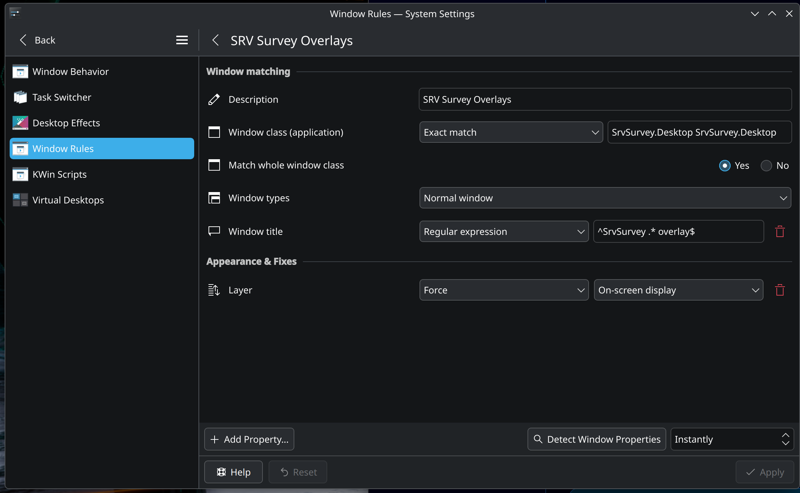

# Overlay Troubleshooting (Linux)

Overlays in SrvSurvey rely on X11 (or XWayland) window management features: click-through, always-on-top / layer placement, window tracking against the Elite Dangerous game window, and (where supported) global input. Most GNOME, Cinnamon, Xfce, and KDE Plasma setups should work out of the box once the display-server requirements in [INSTALL_LINUX.md](INSTALL_LINUX.md) are met.

## Gamescope and the combined overlay host

Ordinary Windows, X11, and XWayland sessions continue to use one native window
per live overlay. When Gamescope is detected, SrvSurvey reparents the same live
Avalonia controls into one transparent game-sized host. Opacity, positioning,
suppression, stream capture, OpenVR capture, and edit-mode dragging continue to
use the existing overlay models; only the native presentation strategy changes.

Check the application log for either `Overlay presentation: CombinedWindow` or
`Overlay presentation: MultipleWindows`. If Gamescope detection is missing,
launch SrvSurvey in the same Gamescope environment as Elite or test explicitly:

```bash
SRVSURVEY_OVERLAY_HOST=combined ./SrvSurvey.Desktop
```

To diagnose a compositor regression, restore the previous behavior with
`SRVSURVEY_OVERLAY_HOST=separate`. The override is read at startup.

## KDE Plasma — overlays not appearing or not staying above Elite

KDE Plasma can refuse to place normal application windows above an exclusive full-screen game. SrvSurvey now checks the X11 window manager's `_NET_SUPPORTED` capabilities. When KWin advertises `_KDE_NET_WM_WINDOW_TYPE_ON_SCREEN_DISPLAY`, SrvSurvey applies that type to runtime overlays, edit previews, and the overlay editor while retaining `_NET_WM_WINDOW_TYPE_NORMAL` as the standards-compatible fallback.

This check is capability-based rather than distribution- or desktop-name-based. Other X11 window managers keep Avalonia's existing normal/topmost behavior, and a failed capability check also falls back to that behavior.

The edit previews remain interactive. Because KWin treats OSD windows as special windows and does not provide its normal interactive move operation for them, SrvSurvey moves those windows directly while the pointer is captured.

If overlays still remain behind Elite, use the following manual rule as a fallback.

### Create the window rule

1. Open **System Settings → Window Management → Window Rules**.
2. Click **Add Rule…** (or the **+** button).
3. Configure the rule exactly as shown below (or use **Detect Window Properties** while an overlay is visible and then refine the match).

| Setting | Value |
|---------|-------|
| **Description** | `SRV Survey Overlays` |
| **Window class (application)** | Exact match → `SrvSurvey.Desktop SrvSurvey.Desktop` |
| **Match whole window class** | Yes |
| **Window types** | All window types |
| **Window title** | Regular expression → `^(SrvSurvey .+|SrvSurveyWindowOne|Overlay position preview|Edit overlay positions)$` |
| **Layer** | Force → **On-screen display** |



The screenshot was captured with an older build and may show **Normal window**. Use **All window types** as listed in the table because current builds can classify the overlay as an OSD window before the fallback rule is evaluated.

4. Click **Apply**.

You can also use **Detect Window Properties** while an overlay is visible to capture the class and title, then set the Layer to **On-screen display**.

The regular expression matches the current runtime overlay titles and the two position-editor window titles without matching the main `SrvSurvey` window. If a future overlay uses a different title pattern you can widen the expression or add a second rule.

After applying the rule, restart SrvSurvey (or simply close and re-open the affected overlays). The overlays should now appear above Elite Dangerous even when the game is exclusive full-screen.

### Why the OSD layer is used on Plasma

Plasma is more restrictive than GNOME about the stacking order of windows relative to exclusive full-screen clients. The **On-screen display** layer is intended for short-lived indicators that must paint above full-screen applications; SrvSurvey uses the same KWin-recognized window type for its overlay surfaces.

## Other desktop environments

- **GNOME / Mutter**: Usually works without extra configuration when running under X11 or XWayland.
- **Xfce / Cinnamon / MATE**: Generally work once the X11 libraries listed in the install guide are present.
- **Pure Wayland (no XWayland)**: Not supported for full overlay functionality. Enable XWayland or switch to an Xorg session.

## Still not working?

1. Confirm both Elite Dangerous and SrvSurvey are running as the **same user** on the **same display** (`echo $DISPLAY`).
2. Verify the session is X11 or XWayland (`echo $XDG_SESSION_TYPE` and `echo $WAYLAND_DISPLAY`).
3. Check that the window class reported by KDE’s “Detect Window Properties” matches `SrvSurvey.Desktop`.
4. Temporarily disable any other compositor effects or “focus stealing prevention” rules that might interfere.
5. Open an issue on the [repository](https://github.com/Fenris159/SrvSurvey/issues) with the output of:

   ```bash
   printf 'session=%s\nDISPLAY=%s\nWAYLAND_DISPLAY=%s\n' \
       "${XDG_SESSION_TYPE:-unset}" \
       "${DISPLAY:-unset}" \
       "${WAYLAND_DISPLAY:-unset}"
   ```

   and a screenshot of any relevant window rules.

See also the general [Linux Troubleshooting](Linux_Troubleshooting.md) document.
