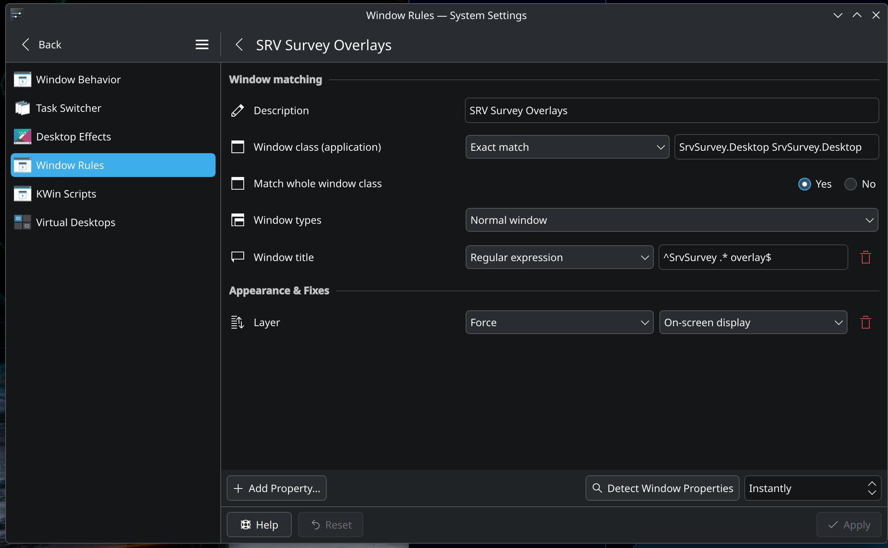

# Overlay Troubleshooting (Linux)

Overlays in SrvSurvey rely on X11 (or XWayland) window management features: click-through, always-on-top / layer placement, window tracking against the Elite Dangerous game window, and (where supported) global input. Most GNOME, Cinnamon, Xfce, and KDE Plasma setups should work out of the box once the display-server requirements in [INSTALL_LINUX.md](INSTALL_LINUX.md) are met.

## Gamescope and the combined overlay host

For the complete CachyOS workflow, including mouse confinement and a launcher
that starts Elite and SrvSurvey in the same nested display, see
[CachyOS: Elite Dangerous, SrvSurvey, KDE Plasma, and Gamescope](CACHYOS_GAMESCOPE.md).

Ordinary Windows, X11, and XWayland sessions continue to use one native window
per live overlay. When Gamescope is detected, SrvSurvey reparents the same live
Avalonia controls into one transparent game-sized host. Opacity, positioning,
suppression, stream capture, OpenVR capture, and edit-mode dragging continue to
use the existing overlay models; only the native presentation strategy changes.

Check the application log for either `Overlay presentation: CombinedWindow` or
`Overlay presentation: MultipleWindows`. If Gamescope detection is missing,
launch SrvSurvey in the same Gamescope environment as Elite or test explicitly:

```bash
SRVSURVEY_OVERLAY_HOST=combined ./SrvSurvey.Desktop
```

To diagnose a compositor regression, restore the previous behavior with
`SRVSURVEY_OVERLAY_HOST=separate`. The override is read at startup.

### SrvSurvey on the desktop with native Wayland Gamescope

A native Wayland Gamescope session can keep Elite on a nested X11 display while
SrvSurvey runs on the desktop XWayland display. In this arrangement SrvSurvey
cannot discover Elite through the desktop X11 window tree. SrvSurvey can instead
read a **Gamescope game-window bridge marker** from the user's
`$XDG_RUNTIME_DIR`. Its Gamescope launch wrapper creates the marker after it
finds the nested `DISPLAY`, and removes it when Gamescope exits. The user does
not create the marker for each game session.

The marker is named `GamescopeGameWindowBridge.<Gamescope PID>` and has three
lines: the Gamescope process start time from `/proc/<PID>/stat`, the nested X11
display (for example `:2`), and the desktop XWayland rectangle of the monitor
hosting fullscreen Gamescope (`x y width height`). SrvSurvey verifies the live
process before using the marker. It then tracks Elite on the nested display
while placing its ordinary, separately interactive overlay windows on the
desktop display. If there is no valid marker, SrvSurvey keeps using its normal
desktop game-window tracker.

The helper [PublishGamescopeGameWindowBridge.sh](../scripts/PublishGamescopeGameWindowBridge.sh)
writes this marker atomically. A native Wayland Gamescope launch wrapper should
call it **after** it knows the Gamescope PID and nested X11 `DISPLAY`, pass the
desktop output name shown by `xrandr --query`, and remove the returned path when
Gamescope stops. For example, inside that wrapper:

```bash
# scope_pid is the PID of the running Gamescope process; nested_display is the
# DISPLAY from Gamescope's XWayland child, not the desktop DISPLAY.
bridge_marker=$(PublishGamescopeGameWindowBridge.sh \
    "$scope_pid" "$nested_display" "$game_output")
# Add to the wrapper's existing exit cleanup:
[[ -z ${bridge_marker:-} ]] || unlink "$bridge_marker"
```

The bridge applies when Gamescope fills the chosen monitor; its rectangle is
the whole monitor. For a smaller or movable Gamescope window, the host rectangle
must instead track that window. The tested native Wayland setup also toggles
Gamescope's relative mouse mode when SrvSurvey enables mouse interaction; see
[the Ubuntu Gamescope guide](UBUNTU_26_GAMESCOPE.md#9-srvsurvey-and-the-gamescope-boundary).

## Dragging panels across multiple monitors

Under **Global overlay behavior**, choose **Overlay monitor**, then enable
**Keep overlays on the selected monitor**. This confines the panel body to that
display while dragging live overlays or editor previews, including displays
with negative coordinates or different vertical offsets. The boundary is
captured when each drag starts so a settings change cannot alter a drag midway.
The lock is off by default.

**Automatic** uses the display containing most of Elite's window, or the primary
display when Elite is not detected. A manually selected display takes precedence
for the drag boundary. Existing game-relative layout coordinates are retained
when saving positions. In combined presentation, the panel must also remain
inside the game-sized host; a selected display outside that host falls back to
the host boundary.

Dragging stops on release, capture loss, or a subsequent pointer event that says
the left button is up. The last accepted move is applied before live positions
are saved. This also protects against a missing release event.

For X11/XWayland diagnosis, look for `Overlay drag:` in the application log under
`~/.local/share/SrvSurvey/logs/` (or the configured XDG data directory). Each drag
records its starting position, scale and lock boundary, a native/reported cursor
sample when available, and its stop reason and largest measured coordinate
difference. Native cursor samples can be ahead of queued input events, so a
nonzero `maxPointerDifferencePx` alone does not establish a coordinate bug.
Include the trace for a problematic drag when reporting continued drifting.

## KDE Plasma — overlays not appearing or not staying above Elite

KDE Plasma can refuse to place normal application windows above an exclusive full-screen game. SrvSurvey now checks the X11 window manager's `_NET_SUPPORTED` capabilities. When KWin advertises `_KDE_NET_WM_WINDOW_TYPE_ON_SCREEN_DISPLAY`, SrvSurvey applies that type to runtime overlays, edit previews, and the overlay editor while retaining `_NET_WM_WINDOW_TYPE_NORMAL` as the standards-compatible fallback.

This check is capability-based rather than distribution- or desktop-name-based. Other X11 window managers keep Avalonia's existing normal/topmost behavior, and a failed capability check also falls back to that behavior.

The edit previews remain interactive. Because KWin treats OSD windows as special windows and does not provide its normal interactive move operation for them, SrvSurvey moves those windows directly while the pointer is captured.

If overlays still remain behind Elite, use the following manual rule as a fallback.

### Create the window rule

1. Open **System Settings → Window Management → Window Rules**.
2. Click **Add Rule…** (or the **+** button).
3. Configure the rule exactly as shown below (or use **Detect Window Properties** while an overlay is visible and then refine the match).

| Setting | Value |
|---------|-------|
| **Description** | `SRV Survey Overlays` |
| **Window class (application)** | Exact match → `SrvSurvey.Desktop SrvSurvey.Desktop` |
| **Match whole window class** | Yes |
| **Window types** | All window types |
| **Window title** | Regular expression → `^SrvSurvey.*overlay$` |
| **Layer** | Force → **On-screen display** |



The screenshot was captured with an older build and may show **Normal window** or the previous longer title expression. Use the exact values in the table: current builds can classify an overlay as an OSD window before the fallback rule is evaluated.

4. Click **Apply**.

You can also use **Detect Window Properties** while an overlay is visible to capture the class and title, then set the Layer to **On-screen display**.

Every runtime overlay, combined host, stream-capture surface, position preview, and position editor now starts with `SrvSurvey` and ends with `overlay`. The regular expression therefore covers all overlay surfaces without matching the main `SrvSurvey` window.

After applying the rule, restart SrvSurvey (or simply close and re-open the affected overlays). The overlays should now appear above Elite Dangerous even when the game is exclusive full-screen.

### Why the OSD layer is used on Plasma

Plasma is more restrictive than GNOME about the stacking order of windows relative to exclusive full-screen clients. The **On-screen display** layer is intended for short-lived indicators that must paint above full-screen applications; SrvSurvey uses the same KWin-recognized window type for its overlay surfaces.

## Other desktop environments

- **GNOME / Mutter**: Usually works without extra configuration when running under X11 or XWayland.
- **Xfce / Cinnamon / MATE**: Generally work once the X11 libraries listed in the install guide are present.
- **Pure Wayland (no XWayland)**: Not supported for full overlay functionality. Enable XWayland or switch to an Xorg session.

## Still not working?

1. Confirm Elite and SrvSurvey run as the same user. They normally need the same display; the native Wayland Gamescope bridge above supports separate desktop and nested displays.
2. Verify the session is X11 or XWayland (`echo $XDG_SESSION_TYPE` and `echo $WAYLAND_DISPLAY`).
3. Check that the window class reported by KDE’s “Detect Window Properties” matches `SrvSurvey.Desktop`.
4. Temporarily disable any other compositor effects or “focus stealing prevention” rules that might interfere.
5. Open an issue on the [repository](https://github.com/Fenris159/SrvSurvey/issues) with the output of:

   ```bash
   printf 'session=%s\nDISPLAY=%s\nWAYLAND_DISPLAY=%s\n' \
       "${XDG_SESSION_TYPE:-unset}" \
       "${DISPLAY:-unset}" \
       "${WAYLAND_DISPLAY:-unset}"
   ```

   and a screenshot of any relevant window rules.

See also the general [Linux Troubleshooting](Linux_Troubleshooting.md) document
and the [CachyOS and Gamescope guide](CACHYOS_GAMESCOPE.md).
